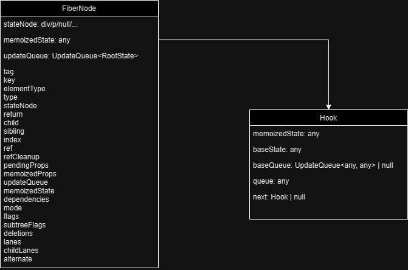

# How hooks work

## Introduction
[Hooks](https://react.dev/reference/react/hooks) were introduced in React
v16.8.0, and since then they changed the way React apps were written.
Before them, we used to create class component for anything involving state
or lifecycle logic.
Hooks made function component the new defacto of writing react apps.

They were a huge addition that simplified a lot of things. I am not stating here
that they are better than class components, but they offer a simpler way
to reason about components and to deal with them, and especially they allow
escaping dealing with `this`.

This is not an explanation of React hooks themselves as they are pretty well
documented in the official documentation. We will see how they are written
into React.

## Context
In the previous sections, precisely in how function components get rendered;
we've seen that we set a `Dispatcher` based on whether your component is
mounting for the first time or updating. So first, let's demystify this
dispatcher.

## `ReactCurrentDispatcher`

in the [`renderWithHooks`](https://github.com/facebook/react/blob/77c4ac2ce88736bbdfe0b29008b5df931c2beb1e/packages/react-reconciler/src/ReactFiberHooks.js#L556)
function, we set the `ReactCurrentDispatcher.current`. Which is a plain
javascript object with all the hooks implementations that React has.

The goal of having the dispatcher object is to limit the behavior of your hooks'
usage:
- You cannot use hooks outside the render phase: This means that hooks
  won't work if you just decide to call the function component manually when
  React isn't rendering. You are probably familiar with the thrown error.
- Hooks behavior on mount and update isn't the same: as we will see later in
  this section, on mount, the main goal of the dispatcher is to `reserve` as
  place for your hook call and initialize it, but on update it will perform
  the update logic which is different.

Like we said, the dispatcher contains as many properties as React hooks:

```tsx
export const AllDispatchers: Dispatcher = {
  readContext,

  use,
  useCallback: hook,
  useContext: hook,
  useEffect: hook,
  useImperativeHandle: hook,
  useInsertionEffect: hook,
  useLayoutEffect: hook,
  useMemo: hook,
  useReducer: hook,
  useRef: hook,
  useState: hook,
  useDebugValue: hook,
  useDeferredValue: hook,
  useTransition: hook,
  useSyncExternalStore: hook,
  useId: hook,
};
```

There are several dispatchers, but we will only discuss the main four:

- `ContextOnlyDispatcher`: [This dispatcher](https://github.com/facebook/react/blob/77c4ac2ce88736bbdfe0b29008b5df931c2beb1e/packages/react-reconciler/src/ReactFiberHooks.js#L3408)
  will prevent you from using hooks outside the render phase. It will throw the
  famous `Invalid hook call` [error.](https://github.com/facebook/react/blob/77c4ac2ce88736bbdfe0b29008b5df931c2beb1e/packages/react-reconciler/src/ReactFiberHooks.js#L440)
- `HooksDispatcherOnMount`: [This dispatcher](https://github.com/facebook/react/blob/77c4ac2ce88736bbdfe0b29008b5df931c2beb1e/packages/react-reconciler/src/ReactFiberHooks.js#L3446)
  contains hooks implementation for components when mounting for the first time.
- `HooksDispatcherOnUpdate`: [This dispatcher](https://github.com/facebook/react/blob/77c4ac2ce88736bbdfe0b29008b5df931c2beb1e/packages/react-reconciler/src/ReactFiberHooks.js#L3484)
  contains hooks implementation for components when they are updating.
- `HooksDispatcherOnRerender`: [This dispatcher](https://github.com/facebook/react/blob/77c4ac2ce88736bbdfe0b29008b5df931c2beb1e/packages/react-reconciler/src/ReactFiberHooks.js#L3522)
  contains hooks implementation when components are re-rendering: when they
  perform a render phase update or when they rendered twice in dev mode.
  

## How hooks are modelled
Each function component may have calls for any of the supported hooks. Remember,
all hooks calls occur withing the `renderWithHooks` function (exception for
the hooks for re-renders, they are called from within the `renderWithHooksAgain`
function).

Hooks are store into the `memoizedState` property of the [related `Fiber`.](https://github.com/facebook/react/blob/77c4ac2ce88736bbdfe0b29008b5df931c2beb1e/packages/react-reconciler/src/ReactFiberHooks.js#L965)

A hook is stored inside React as a plain object with the following properties:

```tsx
const hook: Hook = {
  memoizedState: null,
  
  baseState: null,
  baseQueue: null,
  queue: null,
  
  next: null,
};
```

Where:
- `memoizedState`: contains the hook "state" (or value)
- `baseState`: used by state hooks to store the initial value
- `baseQueue`:
- `queue`:
- `next`: the next hook.

As you may have guessed, the `next` property references in the next hook your
component uses. Thus, hooks are modelled as a linked list of the previous
data structure.

Each hook have its own specification when it comes to what it stores inside
these properties, some hooks don't use all of these properties, obviously.

Notice how this data structure doesn't contain any information about the hook
being used, hooks relies on call order and should ALWAYS be preserved.



Dan Abramov wrote an [outstanding blog post](https://overreacted.io/why-do-hooks-rely-on-call-order/)
explaining this design choice.

### Hooks examples

Assuming we are rendering the following component:
```tsx
function MyFunctionComponent(props) {
  const [count, setCount] = React.useState(0);
  // please don't do this, this is only for demo purposes
  const isMounted = React.useRef(false);
  // please don't do this, this is only for demo purposes
  const mountDate = React.useMemo(() => Date.now(), []);
  
  React.useEffect(() => {
    function handler() {
      console.log('window is focused')
    }
    
    window.addEventListener("focus", handler);
    return () => window.removeEventListener("focus", handler);
  }, []);
  
  return <span>Count is {count}</span>
}
```

Rendering this component will result in having a `Fiber` of tag
`FunctionComponent` with the following hooks linked list:

```tsx
let memoizedState = {
  // useState
  "memoizedState": 0,
  "baseState": 0,
  "baseQueue": null,
  "queue": {
    "pending": null,
    "lanes": 0,
    "lastRenderedState": 0
  },
  "next": {
    // useRef
    "memoizedState": {
      "current": false
    },
    "baseState": null,
    "baseQueue": null,
    "queue": null,
    "next": {
      // useMemo
      "memoizedState": [
        1700218172414,
        []
      ],
      "baseState": null,
      "baseQueue": null,
      "queue": null,
      "next": {
        // useEffect
        "memoizedState": {
          "tag": 9,
          "inst": {},
          "deps": [],
          "next": "the same effect .. removed for clarity"
        },
        "baseState": null,
        "baseQueue": null,
        "queue": null,
        "next": null
      }
    }
  }
}
```

## How hooks on mount work
The purpose on hooks on mount as stated before is to grab a place in the linked
list of the hooks.

So, all hooks implementations on mount will first perform the following:

```tsx
const hook = mountWorkInProgressHook();
```

The `mountWorkInProgressHook` function will create the previous data structure
and then set is as the `memoizedState` property of the `currentlyRenderingFiber`.

### `mountWorkInProgressHook` Implementation

The mount in progress hook function is implemented as follows:

```tsx
function mountWorkInProgressHook(): Hook {
  const hook: Hook = {
    memoizedState: null,

    baseState: null,
    baseQueue: null,
    queue: null,

    next: null,
  };

  if (workInProgressHook === null) {
    // This is the first hook in the list
    currentlyRenderingFiber.memoizedState = workInProgressHook = hook;
  } else {
    // Append to the end of the list
    workInProgressHook = workInProgressHook.next = hook;
  }
  return workInProgressHook;
}
```

- First, it will create the hook object
- Then, if it is the first hook of the list, it will attach it to the
  `memoizedState` of the `currentlyRenderingFiber` and set this hook at the
  `workInProgressHook`
- Or else, it will attach it to the `next` property of the `workInProgressHook`.

And that's it!

Depending on the hook, other things will be performed, we will see them
separately for each supported hook.

## How hooks on update work

When your component is updating (not its first ever render), each supported
hook call will start with the following expression then will follow up with
the specific work.

```tsx
const hook = updateWorkInProgressHook();
```

[`updateWorkInProgressHook`](https://github.com/facebook/react/blob/77c4ac2ce88736bbdfe0b29008b5df931c2beb1e/packages/react-reconciler/src/ReactFiberHooks.js#L973)
is a bit more complex than the mount one, but its purpose it to detect the next
`workInProgressHook` too. it used for both updates and re-renders, so it assumes
that there is either a `current` hook object that can be cloned or a 
`work-in-progress` from a previous render that can be reused.

The first part of this function then is to find the currently rendered hook
value. It will check the `current` rendered fiber's `memoizedState`
property if the `currentHook` module variable is null, or else it takes its
`next` property:

```tsx
// at module level:
let currentHook: null | Hook = null;

// inside updateWorkInProgressHook

let nextCurrentHook: null | Hook;
if (currentHook === null) {
  // the current rendered fiber
  const current = currentlyRenderingFiber.alternate;
  
  // already mounted
  if (current !== null) {
    nextCurrentHook = current.memoizedState;
  } else {
    // first mount
    nextCurrentHook = null;
  }
  
} else {
  nextCurrentHook = currentHook.next;
}
```

Now, after detecting the current rendered (painted) hook value, React will
then try to find its alternate (the being rendered one):

```tsx
// at module level:
let workInProgressHook: null | Hook = null;

// inside updateWorkInProgressHook
let nextWorkInProgressHook: null | Hook;

// first hook of the list, take it from the being rendered fiber
if (workInProgressHook === null) {
  nextWorkInProgressHook = currentlyRenderingFiber.memoizedState;
} else {
  // or else, it is the next hook
  nextWorkInProgressHook = workInProgressHook.next;
}
```
It is important to note that when we start updating a component, the memoized
state property is reset and set to null.

Now, we have the currently painted hook value, and the being rendered one.

When there is a `nextWorkInProgressHook`, this means that we already have
started rendering then we are rendering again without committing and finishing
the render, and thus, we will reuse it as is:

```tsx
if (nextWorkInProgressHook !== null) {
  // There's already a work-in-progress. Reuse it.
  workInProgressHook = nextWorkInProgressHook;
  nextWorkInProgressHook = workInProgressHook.next;

  currentHook = nextCurrentHook;
}
```

Or else, if the `nextCurrentHook` is null, that we are rendering more hooks
than the previous render, which is against hooks rules, and then React will
throw an error.
When `nextCurrentHook` isn't null, this means that we should clone the previous
hook and use it as a base:

```tsx
// React code

if (nextWorkInProgressHook !== null) {
  // previous code
} else {
  if (nextCurrentHook === null) {
    const currentFiber = currentlyRenderingFiber.alternate;
    if (currentFiber === null) {
      // This is the initial render. This branch is reached when the component
      // suspends, resumes, then renders an additional hook.
      // Should never be reached because we should switch to the mount dispatcher first.
      throw new Error(
              'Update hook called on initial render. This is likely a bug in React. Please file an issue.',
      );
    } else {
      // This is an update. We should always have a current hook.
      throw new Error('Rendered more hooks than during the previous render.');
    }
  }

  currentHook = nextCurrentHook;

  // clone from the currently painted hook
  const newHook: Hook = {
    memoizedState: currentHook.memoizedState,

    baseState: currentHook.baseState,
    baseQueue: currentHook.baseQueue,
    queue: currentHook.queue,

    next: null,
  };

  if (workInProgressHook === null) {
    // This is the first hook in the list.
    currentlyRenderingFiber.memoizedState = workInProgressHook = newHook;
  } else {
    // Append to the end of the list.
    workInProgressHook = workInProgressHook.next = newHook;
  }
}
```

## How hooks on rerender work

Re-rendering components is an internal term in the React codebase that means
that the component either scheduled a render phase update or that we are
replaying it in development mode.

If you take a close look at the `HooksDispatcherOnRerender` dispatcher, you will
notice that it is the same as the `HooksDispatcherOnUpdate` except for:
`useReducer: rerenderReducer`, `useState: rerenderState`,
`useDeferredValue: rerenderDeferredValue` and `useTransition: rerenderTransition`.

This dispatcher is set from the [`renderWithHooksAgain`](https://github.com/facebook/react/blob/77c4ac2ce88736bbdfe0b29008b5df931c2beb1e/packages/react-reconciler/src/ReactFiberHooks.js#L771)
function. I will just copy Andrew's comment about this function:

```tsx
// This is used to perform another render pass. It's used when setState is
// called during render, and for double invoking components in Strict Mode
// during development.
//
// The state from the previous pass is reused whenever possible. So, state
// updates that were already processed are not processed again, and memoized
// functions (`useMemo`) are not invoked again.
//
// Keep rendering in a loop for as long as render phase updates continue to
// be scheduled. Use a counter to prevent infinite loops.
```

## How each hook works

We will follow the presence of hooks in the dispatchers order to explain them.

import TBD from "./components/TBDBanner"

## How use works
The `use` hook is a new hook that will replace the `throw promise` pattern
introduced for suspending components that still wait for data.

Suspending using `throw promise` was there since too long, but was never
official, and this hook is introduced as a viable alternative.

### Signature

The `use` hook is [defined here](https://github.com/facebook/react/blob/77c4ac2ce88736bbdfe0b29008b5df931c2beb1e/packages/react-reconciler/src/ReactFiberHooks.js#L1093).

```tsx
function use<T>(usable: Usable<T>): T {
  // [Not Native Code]
}
```

It accepts either a promise or context type.

:::tip
The use hook doesn't rely on `mountWorkInProgressHook` and `updateWIPHook`, so
it can be called conditionally and doesn't obey the rules of hooks.
:::

### Implementation

As stated before, `use` accepts `thenabled` and `Context`:

#### Context
When the provided object to `use` is a React `Context`, it will just delegate
the work to the `readContext` function. It will be discussed and explained
in the `useContext` section.

```tsx
if (
  usable.$$typeof === REACT_CONTEXT_TYPE ||
  usable.$$typeof === REACT_SERVER_CONTEXT_TYPE
) {
  const context: ReactContext<T> = usable;
  return readContext(context);
}
```

So, `use` will allow you to conditionally subscribe to a context while escaping
the rules of hooks 🤯

#### Thenable

When a thenable object is provided, React will call the [internal `useThenable`](https://github.com/facebook/react/blob/77c4ac2ce88736bbdfe0b29008b5df931c2beb1e/packages/react-reconciler/src/ReactFiberHooks.js#L1066)
function:

```tsx
function use<T>(usable: Usable<T>): T {
  if (usable !== null && typeof usable === 'object') {
    if (typeof usable.then === 'function') {
      const thenable: Thenable<T> = usable;
      return useThenable(thenable);
    }
    // ... other code
  }

  throw new Error('An unsupported type was passed to use(): ' + String(usable));
}
```

We've reached a point where the `useThenable` function is clearly behind
the `use` hook's work:

Besides of initializing and incrementing the thenable state (which I will not
explain now), useThenable calls [`trackUsedThenable`](https://github.com/facebook/react/blob/dd480ef923930c8906a02664b01bcdea50707b5d/packages/react-reconciler/src/ReactFiberThenable.js#L69)
which will do the whole work.

```tsx
function useThenable<T>(thenable: Thenable<T>): T {
  // Track the position of the thenable within this fiber.
  const index = thenableIndexCounter;
  thenableIndexCounter += 1;
  if (thenableState === null) {
    // createThenableState returns a plain javascript array
    thenableState = createThenableState();
  }
  // highlight-next-line
  const result = trackUsedThenable(thenableState, thenable, index);
  // ... other code
  return result;
}

```

Let's then dive into `trackUsedThenable`:

1. Part 1: Add the thenable to the array of thenables:
   
   Please pay attention to Sophie's comment: if the there was a thenable at
   the same position, we will reuse the former one because they should
   technically point to the same value. Don't ask me of this design choice.
   ```tsx
   const previous = thenableState[index];
     if (previous === undefined) {
       thenableState.push(thenable);
     } else {
       if (previous !== thenable) {
         // Reuse the previous thenable, and drop the new one. We can assume
         // they represent the same value, because components are idempotent.
   
         // Avoid an unhandled rejection errors for the Promises that we'll
         // intentionally ignore.
         thenable.then(noop, noop);
         thenable = previous;
       }
     }
   ```
   
2. Part 2: Track the thenable
   There are two cases, whether we previously tracked this thenable, or it is
   the first time we encounter it.

   Tracking the thenable is adding a `then(onFullfilement, onRejection)`
   callbacks that will mutate the thenable itself:

   Read well the following code and grasp it:
   ```tsx
   const pendingThenable: PendingThenable<T> = thenable;
   pendingThenable.status = 'pending';
   pendingThenable.then(
     fulfilledValue => {
       if (thenable.status === 'pending') {
         const fulfilledThenable: FulfilledThenable<T> = thenable;
         fulfilledThenable.status = 'fulfilled';
         fulfilledThenable.value = fulfilledValue;
       }
     },
     (error: mixed) => {
       if (thenable.status === 'pending') {
         const rejectedThenable: RejectedThenable<T> = thenable;
         rejectedThenable.status = 'rejected';
         rejectedThenable.reason = error;
       }
     },
   );
   ```
   But before tracking like this, if the thenable was already tracked, we only
   verify its status:

   ```tsx
   switch (thenable.status) {
     case 'fulfilled': {
       const fulfilledValue: T = thenable.value;
       return fulfilledValue;
     }
     case 'rejected': {
       const rejectedError = thenable.reason;
       checkIfUseWrappedInAsyncCatch(rejectedError);
       throw rejectedError;
     }
     // ... other code
   }
   ```
   - When status is `fulfilled`, the `use` hook will return the value
   - When status is `rejected`, the `use` hook will throw the error
   
   When the status is `pending`, React will throw a special exception object
   called `SuspenseException` to suspend the tree until the thenable resolves
   or rejects.

   This will lead to the component rendering only if it has data, and throwing
   in the other cases.

   :::note
   The use hook will require you to put an Error boundary in the tree to
   intercept rejections.
   :::

:::warning
The `use` hook will require you to manually cache/memoize the promises.

The `React.cache` experimental API is designed to help you with that.
:::

### Examples

Let's say we want to get the user details from the public jsonplaceholder API.

To achieve that, we will create a small cache to help us memoizing the promises
and thus avoid infinite renders. So, let's create a dumb memoizer for functions:

```tsx
// we assume that we will cache with one parameter
// which will be the user id.
// React.cache is a general solution for this.
// for clarity, we'll use only userId
function createCache(asyncFunc) {
  let cache = {};

  return function exec(...args) {
    let cacheId = args[0];
    let existing = cache[cacheId];
    if (existing) {
      return existing;
    }

    let result = asyncFunc.apply(null, args);
    cache[cacheId] = result;
    return result;
  };
}
```

Let's then create a dumb error boundary for that too:

```tsx
class ErrorBoundary extends React.Component {
  state = { error: null };
  componentDidCatch(error) {
    this.setState((prev) => ({ ...prev, error }));
  }
  render() {
    const { error } = this.state;
    if (error) {
      return (
        <>
          <pre>{error.toString()}</pre>
          <button
            onClick={() => this.setState((prev) => ({ ...prev, error: null }))}
          >
            Reset
          </button>
        </>
      );
    }
    return this.props.children;
  }
}
```

And finally, let's exploit this code:

```tsx
async function fetchUserById(userId) {
  let result = await axios.get(
    `https://jsonplaceholder.typicode.com/users/${userId}`
  );
  return result.data;
}

let getUserDetails = createCache(fetchUserById);

let IDS = [1, 2, 3, 4, 5, 10, 11];

function UserDetails({ id }) {
  let details = React.use(getUserDetails(id));

  return (
    <details open>
      <pre>{JSON.stringify(details, null, 4)}</pre>
    </details>
  );
}
function Example() {
  let [userId, setUserId] = React.useState(IDS[0]);
  return (
    <div className="App">
      {IDS.map((id) => (
        <button
          onClick={() => {
            setUserId(id);
          }}
          key={id}
        >
          {`User ${id}`}
        </button>
      ))}
      <React.Suspense fallback={`Loading user ${userId}`}>
        <UserDetails id={userId} />
      </React.Suspense>
    </div>
  );
}

export default function App() {
  return (
    <ErrorBoundary>
      <Example />
    </ErrorBoundary>
  );
}
```

You can view and manipulate this [demo here:](https://codesandbox.io/s/lucid-curran-x8xxlj?file=/src/App.js)

<iframe src="https://codesandbox.io/embed/lucid-curran-x8xxlj?fontsize=14&hidenavigation=1&theme=dark"
style={{width: "100%", height: "500px", border: 0, borderRadius: 4}}
title="React.use demo"
allow="accelerometer; ambient-light-sensor; camera; encrypted-media; geolocation; gyroscope; hid; microphone; midi; payment; usb; vr; xr-spatial-tracking"
sandbox="allow-forms allow-modals allow-popups allow-presentation allow-same-origin allow-scripts"></iframe>

## How useCallback works
The `useCallback` hook allows you to keep a function reference until 
a dependency changes.

### Signature
`useCallback` is defined as follows:

```tsx
function useCallback<T>(callback: T, deps: Array<mixed> | void | null): T {
  // [Not Native Code]
}
```

The previous function doesn't exist directly, as stated before, there is
[`mountCallback` ](https://github.com/facebook/react/blob/77c4ac2ce88736bbdfe0b29008b5df931c2beb1e/packages/react-reconciler/src/ReactFiberHooks.js#L2602)
and [`updateCallback`](https://github.com/facebook/react/blob/77c4ac2ce88736bbdfe0b29008b5df931c2beb1e/packages/react-reconciler/src/ReactFiberHooks.js#L2609)
functions, with the same signature:

```tsx
function mountCallback<T>(callback: T, deps: Array<mixed> | void | null): T {
  // [Not Native Code]
}
function updateCallback<T>(callback: T, deps: Array<mixed> | void | null): T {
  // [Not Native Code]
}
```

### Implementation
#### On mount
When your component renders for the first time while using `useCallback`, the
call will be intercepted by `mountCallback`, which is probably the easiest hook:

```tsx
function mountCallback<T>(callback: T, deps: Array<mixed> | void | null): T {
  // step 1
  // highlight-next-line
  const hook = mountWorkInProgressHook();
  // step 2
  // highlight-next-line
  const nextDeps = deps === undefined ? null : deps;
  // step 3
  // highlight-next-line
  hook.memoizedState = [callback, nextDeps];
  return callback;
}
```

- **Step 1**: Mount the hook data structure seen in the top of this section
- **Step 2**: Define the dependencies to use, if the parameter is omitted, `null`
  is used.
- **Step 3**: Store the callback and dependencies in the `memoizedState` of the
  hook.

`useCallback` will return whatever value you throw at it, usually we give either
an inline function defined directly there, or a function defined in the component
body.

So, in mount, useCallback don't care about your dependencies, it will only
store them for later usage.

#### On Update
On updates, the goal is to give you a new function reference **only** if
one dependency changes.

```tsx
function updateCallback<T>(callback: T, deps: Array<mixed> | void | null): T {
  // step 1
  // highlight-next-line
  const hook = updateWorkInProgressHook();
  // step 2
  // highlight-next-line
  const nextDeps = deps === undefined ? null : deps;
  const prevState = hook.memoizedState;
  // step 3
  // highlight-next-line
  if (nextDeps !== null) {
    const prevDeps: Array<mixed> | null = prevState[1];
    // step 4
    // highlight-next-line
    if (areHookInputsEqual(nextDeps, prevDeps)) {
      return prevState[0];
    }
  }
  // step 5
  // highlight-next-line
  hook.memoizedState = [callback, nextDeps];
  return callback;
}
```

- **Step 1**: Create or reuse the hook data structure object.
- **Step 2**: Infer the dependencies array, or `null` if nothing is provided.
- **Step 3**: When dependencies aren't null, which means that we are memoizing
  things (undefined as second argument means that we won't memoize anything), we
  will proceed to compare them with the previous deps.
- **Step 4**: This compares the previous and next dependencies, if they are
  the same, the previous value (the first element in the `memoizedState` array)
  is returned. We'll see the comparison in a few.
- **Step 5**: When dependencies changed or that we aren't using them, similarly
  to `mountCallback`, we store `[callback, nextDeps]` into the `memoizedState`
  property of the hook object.

The [`areHookInputsEqual`](https://github.com/facebook/react/blob/77c4ac2ce88736bbdfe0b29008b5df931c2beb1e/packages/react-reconciler/src/ReactFiberHooks.js#L451)
function is used in all hooks that use the dependencies array. It will:

- Always `return` false when there are no previous dependencies, which instructs
  React to recompute the hook returned value. In human words, this means that
  our hook doesn't use any dependencies and will be refreshed every render.
- Loop over both arrays and use `Object.is` to compare individual values.

## How useContext works
The [`useContext` hook](https://react.dev/reference/react/useContext) allows you
to read and subscribe to a [React Context](https://medium.com/@mohamedelayadi/react-context-all-you-need-to-know-40de6662b074)
value.

### Signature

[`useContext` hook](https://github.com/facebook/react/blob/540bab085d571789f4562565eebfd0db9f36345c/packages/react-reconciler/src/ReactFiberNewContext.js#L713)
is defined as follows:

```tsx
function readContext<T>(context: ReactContext<T>): T {
  // [Not Native Code]
}
```

Where the unique parameter refers to a React context object created by the
[`React.createContext` API.](https://react.dev/reference/react/createContext)

### Implementation
`useContext` uses the [`readContextForConsumer`](https://github.com/facebook/react/blob/540bab085d571789f4562565eebfd0db9f36345c/packages/react-reconciler/src/ReactFiberNewContext.js#L740)
function:

```tsx
export function readContext<T>(context: ReactContext<T>): T {
  // ...dev checks
  return readContextForConsumer(currentlyRenderingFiber, context);
}
```

The `readContextForConsumer` is responsible for giving you the current context
value and also subscribe to it for future changes. Let's dig into its
implementation:

```tsx
function readContextForConsumer<T>(
  consumer: Fiber | null,
  context: ReactContext<T>,
): T {
  
  // step 1
  // highlight-next-line
  const value = isPrimaryRenderer
    ? context._currentValue
    : context._currentValue2;

  // step 2
  // highlight-next-line
  if (lastFullyObservedContext === context) {
    // Nothing to do. We already observe everything in this context.

  // step 3
  // highlight-next-line
  } else {
    
  }
}
```

- **Step 1**: Decides on the internal context value based on the
  `isPrimaryRenderer` renderer property. I don't have much experience with this
  property, but you set it while creating a custom React renderer. Primary means
  that your renderer renders the whole page, and secondary means that you are
  writing a renderer meant to be used on top of another one. In our case, which
  is React-DOM, it is a primary renderer, so we take the `_currentValue` value.
- **Step 2**: The second step will actually bail out reading and subscribing to
  this context. React uses the `lastFullyObservedContext` module variable, which
  [seems to be unused](https://github.com/search?q=repo%3Afacebook%2Freact%20lastFullyObservedContext&type=code).
  I mean, I haven't seen it being written in the whole codebase.
- **Step 3**: The third step is where subscription occurs, let's dig into it.

### How Context subscription works

The context subscription is stored in the `fiber.dependencies` property in
a linked list fashion (again):

```tsx
// simplified
function readContextForConsumer<T>(
  consumer: Fiber | null,
  context: ReactContext<T>,
): T {
  const value = context._currentValue;

  const contextItem = {
    context: (context as ReactContext<any>),
    memoizedValue: value,
    next: null,
  };
}
```

Then, when this is the first `useContext` in this component, it will add the
following object as `dependencies`:

```tsx
// simplified

// the lastContextDependency variable is reset in the prepareToReadContext
// function called when we are about to update components
// (updateFunctionComponent and others)
if (lastContextDependency === null) {
  lastContextDependency = contextItem;
  // consumer is the work in progress fiber
  consumer.dependencies = {
    lanes: NoLanes,
    firstContext: contextItem
  }
}
```

Or else, it will add the context item as the `next` property of the previous one:

```tsx
if (lastContextDependency === null) {
  // ...
} else {
  lastContextDependency = lastContextDependency.next = contextItem;
}
```

And that's it!

### Updates
When a component rendering a `ContextProvider` gets updated, React will check
on the `value` `prop`, and if it changed, it will propagate the changes.

This section will be explained in how rendering of a `ContextProvider` works.

:::note
Similarly to the `use` hook, `useContext` can be called conditionally on render.

But you cannot call it inside other hooks or outside the render phase. Because
it needs the currently rendering fiber to be able to perform subscription.
:::

## How useEffect works
[The `useEffect` hook](https://react.dev/reference/react/useEffect) allows you
to register passive effects on your component.

Passive effects run as the last part of the `commit` phase of the render.
It is either synchronous for `SyncLane`s for `Asynchronous` for the rest lanes.

From the docs:
> useEffect is a React Hook that lets you synchronize a component with an 
> external system.

This means that you should __only__ use this hook to keep your component in sync
with external systems, such as the browser APIs (focus, resize, blur...) or
some external stores.

### Signature

The `useEffect` hooks is defined as follows:

```tsx
function useEffect(
  create: () => (() => void) | void,
  deps: Array<mixed> | void | null,
): void {
  // [Not Native Code]
}
```

It accepts two parameters:
- `create`: the effect creation function, it doesn't accept any parameters, and
  return either nothing, or a `cleanup` function. The cleanup function is
  responsible for cleaning the effect work: such as unsubscribing from an event.
- `deps`: The optional dependencies array, that will result in running the
  effect creation again whenever a dependency changes. If this parameter is
  omitted, the effect will run at **the end of every render phase.**

:::note
If your component performs a render phase state update, the effect won't run
twice. But rather, the effects are ran at the commit phase, after the render is
performed.
:::

### Implementation on mount

Like normal hooks, this hook relies on `mountWorkInProgressHook()`, which
creates the object seen in the start of this section.
`mountEffect` calls a function called `mountEffectImpl`.

:::note
`mountEffectImpl` is called from all the other effect hooks (`useLayoutEffect`,
`useInsertionEffect` and other hooks that add special effects.)
:::

```tsx
function mountEffect(
  create: () => (() => void) | void,
  deps: Array<mixed> | void | null,
): void {
  mountEffectImpl(
    PassiveEffect | PassiveStaticEffect,
    HookPassive,
    create,
    deps,
  );
}
```

Let's discuss the previous snippet before going any longer, to do so, we need
to observe the [`mountEffectImpl` signature:](https://github.com/facebook/react/blob/77c4ac2ce88736bbdfe0b29008b5df931c2beb1e/packages/react-reconciler/src/ReactFiberHooks.js#L2331)

```tsx
function mountEffectImpl(
  fiberFlags: Flags,
  hookFlags: HookFlags,
  create: () => (() => void) | void,
  deps: Array<mixed> | void | null,
): void {
  // [Not Native Code]
}
```

- `fiberFlags`: Flags that will be added to the component using the effect
- `hookFlags`: Flags that define [the effect itself](https://github.com/facebook/react/blob/9cdf8a99edcfd94d7420835ea663edca04237527/packages/react-reconciler/src/ReactHookEffectTags.js#L10),
  possible values are: `Insertion`, `Layout` and `Passive`. `Passive` is used
  for `useEffect`.
- `create`: The effect function
- `deps`: The effect dependencies

Finally, let's take a look at the `useEffectImpl` function before diving more
in this maze:

```tsx
function mountEffectImpl(
  fiberFlags: Flags,
  hookFlags: HookFlags,
  create: () => (() => void) | void,
  deps: Array<mixed> | void | null,
): void {
  // step 1
  // highlight-next-line
  const hook = mountWorkInProgressHook();
  // step 2
  // highlight-next-line
  const nextDeps = deps === undefined ? null : deps;
  // step 3
  // highlight-next-line
  currentlyRenderingFiber.flags |= fiberFlags;
  // step 4
  // highlight-next-line
  hook.memoizedState = pushEffect(
    HookHasEffect | hookFlags,
    create,
    createEffectInstance(),
    nextDeps,
  );
}
```

- **Step 1**: Mount the hook data structure seen in the top of this section
- **Step 2**: Define the dependencies to use, if the parameter is omitted, `null`
  is used.
- **Step 3**: Add the received fiberFlags to the currently rendering fiber. In
  the case of `useEffect`, it is: `PassiveEffect | PassiveStaticEffect`, which
  is a natural number (`8390656` at the moment of writing these words).
- **Step 4**: Store the `memoizedState` value of this hook, which is the result
  of calling the `pushEffect`.

The [`createEffectInstance` function](https://github.com/facebook/react/blob/77c4ac2ce88736bbdfe0b29008b5df931c2beb1e/packages/react-reconciler/src/ReactFiberHooks.js#L2236)
just returns the object `{ destroy: undefined }`. It will be used to store the
effect cleanup function (if any).

So, the last part of this is to take a look at the [`pushEffect` function:](https://github.com/facebook/react/blob/77c4ac2ce88736bbdfe0b29008b5df931c2beb1e/packages/react-reconciler/src/ReactFiberHooks.js#L2202)

```tsx
function pushEffect(
  tag: HookFlags, // useEffect: Passive
  create: () => (() => void) | void,
  inst: EffectInstance, // { destroy: undefined }
  deps: Array<mixed> | null,
): Effect {
  // [Not Native Code]
}
```

#### Create the effect object

This object is created every render for every effect you use, it stores the 
relevant information needed to perform well.
```tsx
const effect: Effect = {
  tag, // The hook flag
  create, // the provided effect function
  inst, // { destroy: undefined }
  deps, // the provided dependencies or null
  // Circular
  next: null, // this will be set next
};
```

#### Link the effect to the function component update queue
Next, React will reference the `currentlyRenderingFiber.updateQueue` property,
and if null, it will initialize it:

```tsx
let componentUpdateQueue: null | FunctionComponentUpdateQueue =
  currentlyRenderingFiber.updateQueue;
if (componentUpdateQueue === null) {
  componentUpdateQueue = createFunctionComponentUpdateQueue();
  currentlyRenderingFiber.updateQueue = componentUpdateQueue;
  // this creates a circular reference (it will be teared a part when committing)
  componentUpdateQueue.lastEffect = effect.next = effect;
}
```
The update queue created by `createFunctionComponentUpdateQueue` looks like this:

```tsx
const updateQueue = {
  lastEffect: null,
  events: null,
  stores: null,
}

// when the memoCache feature is enabled, it will add a memoCache property
// initialized by null
```

It is used as a circular linkedList, when we store the lastEffect (its `next`
property will then point to the `first` effect in the list.)

When the component `updateQueue` is already initialized (we've called an
effect before in this render, or another hook initialized it), React will take 
the `lastEffect` property and:

- If `null` (may happen if the updateQueue was initialized by events or stores
  and not by an effect), it will do the same as before: will create a circular
  reference by the `effect` object and itself, and store it in the `lastEffect`
  property of the queue.
  ```tsx
  const lastEffect = componentUpdateQueue.lastEffect;
  if (lastEffect === null) {
    componentUpdateQueue.lastEffect = effect.next = effect;
  } else {
      // take a look next
  }
  ```
- Not `null` means that we called an effect hook before in this render pass,
  and in this case, React will execute this code:
  ```tsx
  const firstEffect = lastEffect.next;
  lastEffect.next = effect;
  effect.next = firstEffect;
  componentUpdateQueue.lastEffect = effect;
  ```
  Don't be confused, let's break the previous code:
  - First, reference the first effect on the list (well, since it is a circular
  linked list, the first is the `next` of the last).
  - Add the new effect as the `next` of the previous `lastEffect`: well, this is
  the new last.
  - The new effect (which is the new last) will point then to the `firstEffect`
  in its `next` property.
  - Finally, mark the new effect as the lastEffect in the list in the component
  `updateQueue`.

Finally, the `pushEffect` function will return the new effect object defined
below and store it in the `hook.memoizedState`.

### Implementation on update

On updates, `useEffect` will [call `updateEffect`](https://github.com/facebook/react/blob/77c4ac2ce88736bbdfe0b29008b5df931c2beb1e/packages/react-reconciler/src/ReactFiberHooks.js#L2407)
from the`HooksDispatcherOnUpdate` dispatcher, which will delegate to the
[`updateEffectImpl` function](https://github.com/facebook/react/blob/77c4ac2ce88736bbdfe0b29008b5df931c2beb1e/packages/react-reconciler/src/ReactFiberHooks.js#L2348).

:::note
These functions have the same signature as the mount ones.

The only difference to note is the passed `fiberFlags`: On mount we passed
`PassiveEffect | PassiveStaticEffect`, and on update we pass only `PassiveEffect`.

At the moment of writing these words, I cannot seem to know what causes this
difference, I cannot find any place in [the React codebase](https://github.com/search?q=repo%3Afacebook%2Freact%20PassiveStatic&type=code)
where the`PassiveStaticEffect` is used to build any decision. Apart from some
todos, so maybe an incoming/unfinished feature.

But there is also the following comment where static [flags are declared:](https://github.com/facebook/react/blob/768f965de2d4c6be7f688562ef02382478c82e5b/packages/react-reconciler/src/ReactFiberFlags.js#L59)
```tsx
// Static tags describe aspects of a fiber that are not specific to a render,
// e.g. a fiber uses a passive effect (even if there are no updates on this particular render).
// This enables us to defer more work in the unmount case,
// since we can defer traversing the tree during layout to look for Passive effects,
// and instead rely on the static flag as a signal that there may be cleanup work.
export const RefStatic = /*                    */ 0b0000001000000000000000000000;
export const LayoutStatic = /*                 */ 0b0000010000000000000000000000;
export const PassiveStatic = /*                */ 0b0000100000000000000000000000;
export const MaySuspendCommit = /*             */ 0b0001000000000000000000000000;
```
:::

In addition to passed parameters, the implementation surely differ, because
on updates, we need to check if dependencies changed:

So, first, the `updatewWorkInProgressHook` function is called.

```tsx
function updateEffectImpl(
  fiberFlags: Flags, // PassiveEffect
  hookFlags: HookFlags, // HookPassive for useEffect
  create: () => (() => void) | void,
  deps: Array<mixed> | void | null,
): void {
  const hook = updateWorkInProgressHook();
  const nextDeps = deps === undefined ? null : deps;
  // the effect from the previous render
  const effect: Effect = hook.memoizedState;
  // the effect instance from the previous render, it will be reused
  const inst = effect.inst;

  // currentHook is null on initial mount when rerendering after a render phase
  // state update or for strict mode.
  // we've seen currentHook at the start of this section, in updateWIPHook
  if (currentHook !== null) {
    if (nextDeps !== null) {
      const prevEffect: Effect = currentHook.memoizedState;
      const prevDeps = prevEffect.deps;
      if (areHookInputsEqual(nextDeps, prevDeps)) {
        // pushEffect was described on mount above, we call it here too
        hook.memoizedState = pushEffect(hookFlags, create, inst, nextDeps);
        return;
      }
    }
  }

  // add the fiberFlags to the fiber.flags
  currentlyRenderingFiber.flags |= fiberFlags;
  hook.memoizedState = pushEffect(
    HookHasEffect | hookFlags,
    create,
    inst,
    nextDeps,
  );
}
```

:::tip
This is how useEffect works, the effect functions are executed in the commit
phase. During render, we just store the relevant information.

Please refer to the [`how commit works` section](/how-react-works/docs/react-dom/how.commit.works#how-commitroot-works)
for more information about the timing of invocation of each type of effects.
:::

## How useImperativeHandle works
The [`useImperativeHandle` hook](https://react.dev/reference/react/useImperativeHandle)
is defined in the official docs as:

> useImperativeHandle is a React Hook that lets you customize the handle exposed
> as a ref.

In human words for the rest of us, this means that it lets you override what
a component is exposing as ref (the handle), for example, if you want to add a 
function to your custom button, let's say, you want to add a `sayHiTo(name)`
function to it that will show an `alert`, and so on.

### Signature

The `useImerativeHandle` is defined as follows:

```tsx
function mountImperativeHandle<T>(
  ref: {current: T | null} | ((inst: T | null) => mixed) | null | void,
  create: () => T,
  deps: Array<mixed> | void | null,
): void {
  // [Not Native Code]
}
```

- **ref**: The ref, created by `useRef` or `createRef`, can be also a ref
  callback
- **create**: The function that will return the new ref '`handle`'
- **deps**: The hook dependencies, the create function will be called again
  when a dependency changes.

### Implementation on mount
When the component using `useImperativeHandle` renders for the first time,
it will call the [`mountImperativeHandle` function](https://github.com/facebook/react/blob/77c4ac2ce88736bbdfe0b29008b5df931c2beb1e/packages/react-reconciler/src/ReactFiberHooks.js#L2533)
which is implemented as follows:

```tsx
// step 1
// highlight-next-line
const effectDeps = deps !== null && deps !== undefined ? deps.concat([ref]) : null;
// step 2
// highlight-next-line
mountEffectImpl(
  UpdateEffect | LayoutStaticEffect,
  HookLayout,
  imperativeHandleEffect.bind(null, create, ref),
  effectDeps,
);
```

- **Step 1**: Compute the real hook dependencies: The provided ones in addition
  to the ref object itself. Maybe we can skip adding the ref to the array and
  suppose the developer should add it manually ? But this won't be backward
  compatible anyway.
- **Step 2**: The second step is to mount an effect (wait! what ? 😳)

Yes, you've read that right, `useImperativeHandle` will insert a special layout 
effect whose `create` function is the [`imperativeHandleEffect` function](https://github.com/facebook/react/blob/77c4ac2ce88736bbdfe0b29008b5df931c2beb1e/packages/react-reconciler/src/ReactFiberHooks.js#L2503)

:::tip
During the commit phase, React will attach refs at the `Layout` phase. That's
why the whole work is used as a layout effect.
:::

### Implementation on update

On updates, `useImperativeHandle` will calculate the deps like on mount,
and then call to `updateEffectImpl` with only `UpdateEffect` as fiber flags.

This brings us to the real work.

### How `useImperativeHandle` works

#### Signature

```tsx
function imperativeHandleEffect<T>(
  create: () => T,
  ref: {current: T | null} | ((inst: T | null) => mixed) | null | void,
): void | (() => void) {
  // [Not Native Code]
}
```

#### Implementation

The implementation will perform the work based on whether the passed ref is
a ref object or a ref callback, and either ways will call your passed `create`
function and return a cleanup function for the layout effect:

```tsx
if (typeof ref === 'function') {
  // step 1
  // highlight-next-line
  const refCallback = ref;
  // step 2
  // highlight-next-line
  const inst = create();
  // step 3
  // highlight-next-line
  refCallback(inst);
  // step 4
  // highlight-next-line
  return () => {
    refCallback(null);
  };
}
```

- **Step 1**: keep track of the passed ref callback reference
- **Step 2**: call the useImperativeHandle create function, that will produce
  the new ref handle
- **Step 3**: call the ref callback with the resulting handle
- **Step 4**: return the layout effect cleanup to call the ref callback again 
  with a null value

Alternatively, when the passed `ref` is a `refObject`, then 
`imperativeHandleEffect` will:

```tsx
// this is origannly an else if
if (ref !== null && ref !== undefined) {
  // step 1
  // highlight-next-line
  const refObject = ref;
  // step 2
  // highlight-next-line
  const inst = create();
  // step 3
  // highlight-next-line
  refObject.current = inst;
  // step 4
  // highlight-next-line
  return () => {
    refObject.current = null;
  };
}
```

- **Step 1**: keep track of the passed ref object reference
- **Step 2**: call the useImperativeHandle create function, that will produce
  the new ref handle
- **Step 3**: attach the resulting ref handle to the `current` property of the 
  ref object
- **Step 4**: return the layout effect cleanup that will reset the `current`
  property to null

And that's it!

:::note
As stated before, the `imperativeHandleEffect` will be invoked during the
layout effect iteration of the commit phase. It won't be called right away
during render.
:::

## How useInsertionEffect works

The [`useInsertionEffect` hook](https://react.dev/reference/react/useInsertionEffect)
by definition:

> Allows inserting elements into the DOM before any layout effects fire

As stated in its official documentation section, it should only be used by
css-in-js library authors, if not, please use `useLayoutEffect` or `useEffect`.

### Signature

Same as other effects, the `useInsertionEffect` is defined as follows:

```tsx
function useInsertionEffect(
  create: () => (() => void) | void,
  deps: Array<mixed> | void | null,
): void {
  // [Not Native Code]
}
```

### Implementation
The `useInsertionEffect` implementation is the [same as `useEffect`](#how-useeffect-works),
the only difference is the `flags` being passed on mount to `mountEffectImpl`
and on update to `updateEffectImpl`:

- On mount: React passes `UpdateEffect` as fiber flags and `HookInsertion` as
  hook flags.
- On update: React passes `UpdateEffect` as fiber flags and `HookInsertion` as
  hook flags.

And that's it! All effects only differ in the flags.

## How useLayoutEffect works
The [`useLayoutEffect` hook](https://react.dev/reference/react/useLayoutEffect)
by definition is:

> Is a version of useEffect that fires before the browser repaints the screen.

Well, that's not totally true when it comes to comparing it to useEffect,
the [`how commit works` section](/how-react-works/docs/react-dom/how.commit.works#how-commitroot-works)
will reveal more information about that.

`useLayoutEffect` allows you to register effect that run after the render phase
synchronously after mutating the dom elements.

Its synchronous nature blocks the browser's main thread and thus prevent it from
partially painting the new render resulting UI. Which makes us often say:
`useLayoutEffect` runs before the browser's paint.

`useLayoutEffect` runs at the same time as `ClassComponent` lifecycle methods
(`componentDidMount` and `componentDidUpdate`)

### Signature

Same as other effects, the `useInsertionEffect` is defined as follows:

```tsx
function useLayoutEffect(
  create: () => (() => void) | void,
  deps: Array<mixed> | void | null,
): void {
  // [Not Native Code]
}
```

### Implementation
The `useLayoutEffect` implementation is the [same as `useEffect`](#how-useeffect-works),
the only difference is the `flags` being passed on mount to `mountEffectImpl`
and on update to `updateEffectImpl`:

- On mount: React passes `UpdateEffect | LayoutStaticEffect` as fiber flags and
  `HookLayout` as hook flags.
- On update: React passes `UpdateEffect` as fiber flags and `HookLayout` as
  hook flags.

And that's it! All effects only differ in the flags.

## How useMemo works
The [`useMemo` hook](https://react.dev/reference/react/useMemo) allows you to
cache a value until a dependency changes.

### Signature
`useMemo` is defined as follows:

```tsx
function useMemo<T>(
  nextCreate: () => T,
  deps: Array<mixed> | void | null,
): T {
  // [Not Native Code]
}
```

Where:
- **`nextCreate`**: The function that will output our cached value
- **`deps`**: The dependencies

### Implementation on mount
On mount, `useMemo` will [call `mountMemo`](https://github.com/facebook/react/blob/77c4ac2ce88736bbdfe0b29008b5df931c2beb1e/packages/react-reconciler/src/ReactFiberHooks.js#L2623)
which is defined as follows:

```tsx
function mountMemo<T>(
  nextCreate: () => T,
  deps: Array<mixed> | void | null,
): T {
  // step 1
  // highlight-next-line
  const hook = mountWorkInProgressHook();
  // step 2
  // highlight-next-line
  const nextDeps = deps === undefined ? null : deps;
  // step 3
  // highlight-next-line
  const nextValue = nextCreate();
  // step 4
  // highlight-next-line
  hook.memoizedState = [nextValue, nextDeps];
  // step 5
  // highlight-next-line
  return nextValue;
}
```

- **Step 1**: create the hook object on mount
- **Step 2**: calculate the deps to use, either the provided ones or `null`
- **Step 3**: calculate the initial memo value
- **Step 4**: store `[nextvalue, nextDeps]` as the `memoizedState` of the hook
- **Step 5**: return the cached value

:::note
When in development mode and under StrictMode, React will call the `nextCreate`
twice:

```tsx
// initialized in the renderWithHooks function
if (shouldDoubleInvokeUserFnsInHooksDEV) {
  nextCreate();
}
```
:::

### Implementation on update
On updates, `useMemo` will [call `updateMemo`](https://github.com/facebook/react/blob/77c4ac2ce88736bbdfe0b29008b5df931c2beb1e/packages/react-reconciler/src/ReactFiberHooks.js#L2637)
which is defined as follows:

```tsx
function updateMemo<T>(
  nextCreate: () => T,
  deps: Array<mixed> | void | null,
): T {
  // step 1
  // highlight-next-line
  const hook = updateWorkInProgressHook();
  // step 2
  // highlight-next-line
  const nextDeps = deps === undefined ? null : deps;
  // step 3
  // highlight-next-line
  const prevState = hook.memoizedState;
  // Assume these are defined. If they're not, areHookInputsEqual will warn.
  if (nextDeps !== null) {
    const prevDeps: Array<mixed> | null = prevState[1];
    // step 4
    // highlight-next-line
    if (areHookInputsEqual(nextDeps, prevDeps)) {
      return prevState[0];
    }
  }
  if (shouldDoubleInvokeUserFnsInHooksDEV) {
    nextCreate();
  }
  // step 5
  // highlight-next-line
  const nextValue = nextCreate();
  // step 6
  // highlight-next-line
  hook.memoizedState = [nextValue, nextDeps];
  return nextValue;
}
```

- **Step 1**: create the hook object on update (or reuse from incomplete render)
- **Step 2**: calculate the deps to use, either the provided ones or `null`
- **Step 3**: reference the previous rendered value (even if the render was
  incomplete, use the rendered value, because it matters)
- **Step 4**: when dependencies are the same, the previously cached value is
  returned
- **Step 5**: compute again the cached value using the passed `nextCreate` memo
  function
- **Step 6**: store the `[nextValue, nextDeps]` along with the deps in the
  `memoizedState` of the hook and return the new cached value.

And that's it! `useMemo` is similar to `useCallback` in terms of implementation
and complexity, the difference is that `useMemo` calls your function and
`useCallback` will give it back to you.

## How useReducer works
<TBD />

## How useRef works
The `[useRef` hook](https://react.dev/reference/react/useRef) gives you a
reference that you can control as you please. You can reference any javascript
value in it.

In the official docs, it is stated that:
> useRef is a React Hook that lets you reference a value that’s not needed for
> rendering.

React tries to push you not to use this ref and base your decisions on it while
the component is rendering. It is okay though to manipulate it outside render.

For example, if you mutate this value during render, React may render several
times and thus write on it multiple times. The easiest way to observe this for
example is by using a ref to count how many times your component rendered. In
development mode and under strict mode, you will all the time get wrong results.
That one reason to get away from it for this kind of usage.

People also often use the ref to detect whether the component is currently
mounting or not, but this is also wrong: since if the component mounted already
then suspended waiting for data while showing a Suspense fallback, the component
stays mounted and thus any decision based on that value will be wrong.

You can also pass this ref object to any HTML element and React will attach the
real DOM element on layout effect. Again, this is yet another reason to get
away from this hook during render and minimize its usage.

Please refer to the official docs to learn more when to use and when not
to use the `useRef` hook.

### Signature
The `useRef` hook is defined as follows:

```tsx
function mountRef<T>(initialValue: T): {current: T} {
  // [Not Native Code]
}
```

### Implementation on mount
When your component using `useRef` renders for the first time, it will call
the [`mountRef` function](https://github.com/facebook/react/blob/77c4ac2ce88736bbdfe0b29008b5df931c2beb1e/packages/react-reconciler/src/ReactFiberHooks.js#L2257),
which is probably the easiest hook ever:

```tsx
// simplified: dev warning about reading from ref during render were removed
// for clarity
function mountRef<T>(initialValue: T): {current: T} {
  // step 1
  // highlight-next-line
  const hook = mountWorkInProgressHook();
  // step 2
  // highlight-next-line
  const ref = {current: initialValue};
  // step 3
  // highlight-next-line
  hook.memoizedState = ref;
  // step 4
  // highlight-next-line
  return ref;
}
```

- **Step 1**: create the hook object on mount
- **Step 2**: create a javascript object with one `current` property,
  initialized by the `initialValue` received by `useRef`
- **Step 3**: store this object as the `memoizedState` of this hook
- **Step 4**: return the ref object

### Implementation on update
On updates, `useRef` will call the [`updateRef` function](https://github.com/facebook/react/blob/77c4ac2ce88736bbdfe0b29008b5df931c2beb1e/packages/react-reconciler/src/ReactFiberHooks.js#L2326)
which is very simple and doesn't need any explanations:

```tsx
function updateRef<T>(initialValue: T): {current: T} {
  const hook = updateWorkInProgressHook();
  return hook.memoizedState;
}
```

It just creates the hook object while reusing the ref mutable object as is,
and will return the memoized state directly.

## How useState works
<TBD />

## How useDebugValue works
This is an empty hook that only works in development mode.

The implementation of `useDebugValue` is empty as [shown in `mountDebugValue`]:(https://github.com/facebook/react/blob/77c4ac2ce88736bbdfe0b29008b5df931c2beb1e/packages/react-reconciler/src/ReactFiberHooks.js#L2594)

```tsx
function mountDebugValue<T>(value: T, formatterFn?: (value: T) => mixed): void {
  // This hook is normally a no-op.
  // The react-debug-hooks package injects its own implementation
  // so that e.g. DevTools can display custom hook values.
}

const updateDebugValue = mountDebugValue;
```

When taking a look at [the `ReactDebugHooks.js` file](https://github.com/facebook/react/blob/aec521a96d3f1bebc2ba38553d14f4989c6e88e0/packages/react-debug-tools/src/ReactDebugHooks.js#L238)
we can see that this hook's implementation only pushes the logged value
to a module level array that collects information to be shown in the React
devtools, which is out of scope of this article and won't be an easy thing
to document for now.

## How useDeferredValue works
<TBD />

## How useTransition works
<TBD />

## How useSyncExternalStore works
<TBD />

## How useId works
<TBD />

## Annex

This is a table for all the internal stored value for all hooks:

| Hook                   | `memoizedState`    | Comment(s)                                                                                                                    |
|------------------------|--------------------|-------------------------------------------------------------------------------------------------------------------------------|
| `use`                  | `N/A`              | `use` doesn't obey the rules of hooks and does not use the internal data structure                                            |
| `useCallback`          | `[callback, deps]` | `useCallback` saves the passed callback and dependencies                                                                      |
| `useContext`           | `N/A`              | `useContext` doesn't rely on hooks call order, it is stored in the `fiber.dependencies` property                              |
| `useEffect`            | `effect`           | `useEffect` saves the effect object created by `pushEffect` which references the effect function, the deps and so on          |
| `useImperativeHandle`  | `effect`           | `useImperativeHandle` calls is a `useLayoutEffect` under the hood                                                             |
| `useLayoutEffect`      | `effect`           | `useLayoutEffect` saves the effect object created by `pushEffect` which references the effect function, the deps and so on    |
| `useInsertionEffect`   | `effect`           | `useInsertionEffect` saves the effect object created by `pushEffect` which references the effect function, the deps and so on |
| `useMemo`              | `[value, deps]`    | `useMemo` saves the resulting cached value and the dependencies                                                               |
| `useReducer`           | `TBD`              |                                                                                                                               |
| `useRef`               | `{current: value}` | `useRef` saves the `{current: value}` as memoized state                                                                       |
| `useState`             | `TBD`              |                                                                                                                               |
| `useDebugValue`        | `N/A`              | `useDebugValue` is an empty hook that is inject by the devtools                                                               |
| `useDeferredValue`     | `TBD`              |                                                                                                                               |
| `useTransition`        | `TBD`              |                                                                                                                               |
| `useSyncExternalStore` | `TBD`              |                                                                                                                               |
| `useId`                | `TBD`              |                                                                                                                               |


