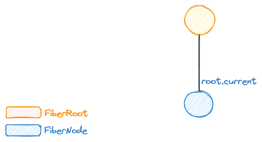
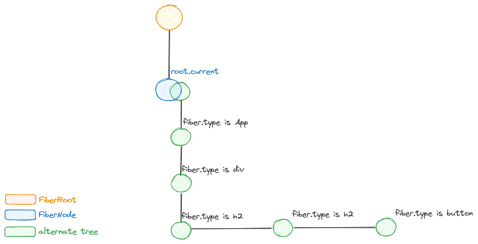
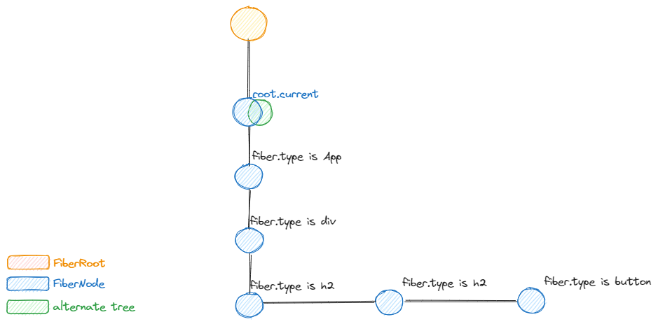
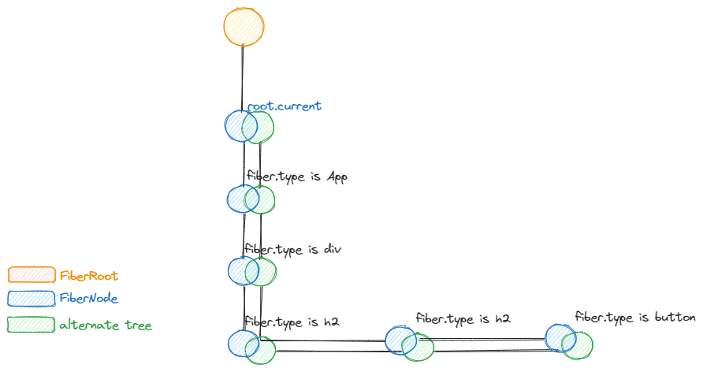

# How Fibers creation works ⏸️

:::note
This section is a `⏸️ break`, we won't continue from where we stopped
in the previous section, but we will take the discussion to another subject
as important before going back.
:::

In this section, we will discover how, where and when all fiber's creation
occur inside React.

We've seen so many, so this is like an extension, but we will restart from the
beginning.

## How creating the first fibers works

The first created fiber refers to the `fiberRoot.current` property.

Let's restart from the begging and go by a simple example:

```tsx
import * as React from "react";
import { createRoot } from "react-dom/client";

// 1
// highlight-next-line
const root = createRoot(document.getElementById("root"));

// 2
// highlight-next-line
root.render(<App />);

function App() {
  const rerender = useRerender();
  return (
    <div>
      <h2>Hello, world!</h2>
      <h3>Hello again</h3>
      <button onClick={rerender}>rerender</button>
    </div>
  );
}

// ignore this, used to rerender our component
function useRerender() {
  return React.useState(0)[1].bind(null, (prev) => prev + 1);
}
```

During step 1, right after calling `createRoot(container)`, here is the tree
at that time:



Next, during step 2 which will schedule things are perform lots of work, React
will construct the alternate tree, because we didn't show (commit) anything yet:



This creation was performed inside `reconcileChildren` seen in how reconciliation
works.

After commit, the `root.current.alternate` will take over and be the new current:



This process of swapping the alternate tree with the current tree is what will
happen all the time at runtime.

On updates, here is what our tree will look like:



To visualize this for yourself, go to any of your React applications (or if you
want, here is the link to the sandbox with our [used example](https://codesandbox.io/s/intelligent-colden-kr4tn3?file=/src/App.js))
execute the following in the console of your browser:

```tsx
// assuming there is one root
[...window.__REACT_DEVTOOLS_GLOBAL_HOOK__.getFiberRoots(1)][0];
```

This will give you the first `root`, access `root.current` and start looking
at `child` and `sibling` and `alternate` properties.

## How the `alternate` works

### What is the alternate

The `alternate` is a `FiberNode` object. It is created when a `fiber` is about
to render. It is created from the `current` painted tree.

React can render several times like we saw earlier before committing.

Alternate fibers are created during reconciliation from the parent:

Let's go back to our previous example where we trigger an update from our `App`
component.

```tsx
function App() {
  const rerender = useRerender();
  return (
    <div>
      <h2>Hello, world!</h2>
      <h3>Hello again</h3>
      <button onClick={rerender}>rerender</button>
    </div>
  );
}
```

Let's suppose the triggerred update is with a `SyncLane` which will result
in rendering it immediately.

This will first create the `alternate` fiber for the `App` component's fiber,
then render it and obtain new children.

Then, it will call `reconcileChildren` like this:
```tsx
reconcileChildren(
  // the returnFiber (the new tree)
  App_Alternate_Fiber,
  // the first child of the current tree
  div_Current_Fiber,
  // the new children: a ReactNode: our div
  {
    type: "div",
    $$typeof: Symbol("react.element"),
    props: {
      children: [
        // h2
        {$$typeof: Symbol("react.element"), type: "h2", props: {children: "Hello, world!"}},
        // h3
        {},
      ]
    }
  },
  // the renderLanes
  SyncLane
)
```

`reconcileChildren` will actually attach the first child to the current
`alternate`.

```tsx
function reconcileChildren(
  current, workInProgress, nextChildren, renderLanes
) {
  workInProgerss.child = ...
}
```

### How the alternate is created

The fiber and alternate are both instances of [`FiberNode`](https://github.com/facebook/react/blob/eaa696876ee40bb048727aefe995be1bbb7384a8/packages/react-reconciler/src/ReactFiber.js#L136)
, the only instantiation using the `FiberNode` constructor occurs in the
[`createFiber`](https://github.com/facebook/react/blob/eaa696876ee40bb048727aefe995be1bbb7384a8/packages/react-reconciler/src/ReactFiber.js#L230)
function:

```tsx
function createFiber(
  tag: WorkTag,
  pendingProps: mixed,
  key: null | string,
  mode: TypeOfMode,
): Fiber {
  return new FiberNode(tag, pendingProps, key, mode);
}
```

`createFiber` is then called either directly or transitively by so many other
functions in the whole codebase.

Here are some of the functions that will create fibers directly:

```tsx

// this function is called from prepareFreshStack and while rendering some
// component tags such as MemoComponent or suspense fallback. Or when
// cloning child fibers (cloneChildFibers) which is called when bailout
// on finished work is called. This function is also called from useFiber
// during reconciliation.
// highlight-next-line
function createWorkInProgress(current, pendingProps) {}


// this function is called from createRoot
// highlight-next-line
function createHostRootFiber(tag, isStrictMode, concurrentUpdatesByDefaultOverride) {}


// called from createFiberFromElement(element, mode, lanes) during reconciliation
// and when rendering memo components
function createFiberFromTypeAndProps(
  type: any, // the component
  key: null | string, // key
  pendingProps: any, // nextProps
  source, // used in dev mode, contains the fileName and lineNumber
  owner: null | Fiber, // used in dev mode, a fiber
  mode: TypeOfMode, // 
  lanes: Lanes // 
) {}


// the following calls occurs from within the function createFiberFromTypeAndProps
// defined in ReactFiber module.
// it serves as a dispatchers to the real creation per tag.
// React uses so many functions to avoid any wrong abstraction or possible
// bugs due to several clashing cases.
// <Explicit code is the best code>
function createFiberFromFragment(elements, mode, lanes, key) {}
function createFiberFromScope(scope, pendingProps, mode, lanes, key) {}
function createFiberFromProfiler(pendingProps, mode, lanes, key) {}
function createFiberFromSuspense(pendingProps, mode, lanes, key) {}
function createFiberFromSuspenseList(pendingProps, mode, lanes, key) {}
function createFiberFromOffscreen(pendingProps, mode, lanes, key) {}
function createFiberFromLegacyHidden(pendingProps, mode, lanes, key) {}
function createFiberFromCache(pendingProps, mode, lanes, key) {}
function createFiberFromTracingMarker(pendingProps, mode, lanes, key) {}
function createFiberFromText(content, mode, lanes) {}
function createFiberFromHostInstanceForDeletion() {}
function createFiberFromDehydratedFragment(dehydratedNode) {}
function createFiberFromText(content, mode, lanes) {}
function createFiberFromPortal(portal, mode, lanes) {}
function createFiberFromPortal(portal, mode, lanes) {}

// All the previous functions have a similar shape than this one:
function createSpecialFiber(
  pendingProps,
  mode,
  lanes,
  key
) {
  const fiber = createFiber(SpecialTag, pendingProps, key, mode);
  // element type when assigned to a react internal value means that it is
  // for internal usage only and that it may be exported as a component
  // such Suspense...
  fiber.elementType = REACT_SPECIAL_ELEMENT_TYPE; // or component type
  fiber.lanes = lanes;
}

```

The fibers instantiation [will initialize all the attributes](https://github.com/facebook/react/blob/eaa696876ee40bb048727aefe995be1bbb7384a8/packages/react-reconciler/src/ReactFiber.js#L136)
a fiber uses and that's it.


